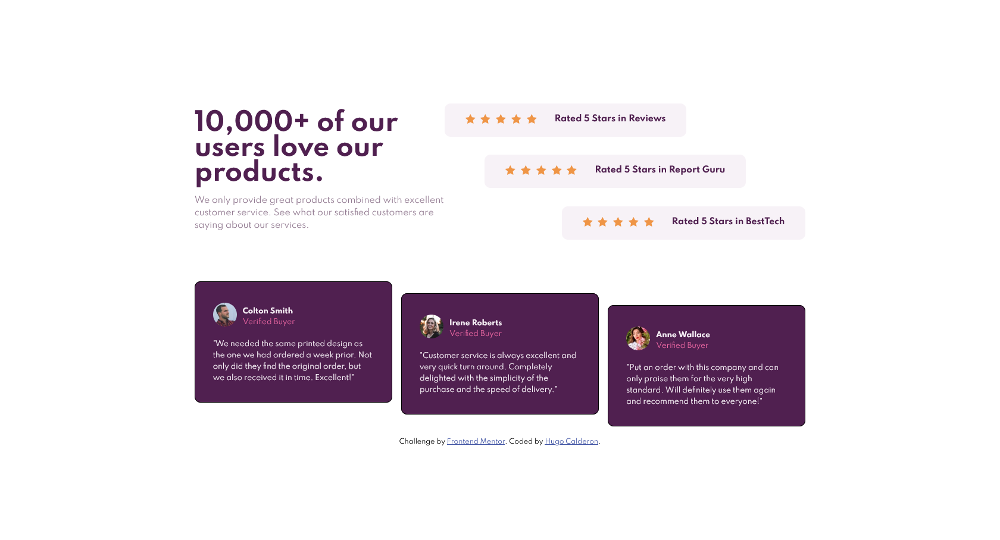

# Frontend Mentor - Social proof section solution

This is a solution to the [Social proof section challenge on Frontend Mentor](https://www.frontendmentor.io/challenges/social-proof-section-6e0qTv_bA). Frontend Mentor challenges help you improve your coding skills by building realistic projects. 

## Table of contents

- [Overview](#overview)
  - [The challenge](#the-challenge)
  - [Screenshot](#screenshot)
  - [Links](#links)
- [My process](#my-process)
  - [Built with](#built-with)
  - [What I learned](#what-i-learned)
  - [Useful resources](#useful-resources)
- [Author](#author)

## Overview

### The challenge

Users should be able to:

- View the optimal layout for the section depending on their device's screen size

### Screenshot

### Links

- Solution URL: [Add solution URL here](https://your-solution-url.com)
- Live Site URL: [Add live site URL here](https://your-live-site-url.com)

## My process

### Built with

- Semantic HTML5 markup
- CSS custom properties
- Flexbox
- CSS Grid
- Mobile-first workflow
- [Sass](https://sass-lang.com/) - JS library

### What I learned

I learned to use FlexBox and to organize the sections with the different tags that exist in HTML, I also learned to use Sass.

I have learned to convert a design provided to the Website and to try to build it as accurate as I can.

### Useful resources

- [css-tricks.com](https://css-tricks.com/snippets/css/a-guide-to-flexbox/) - This article helped me reinforce my knowledge of Flexbox.

## Author

- Website - [Hugo Calderón](https://hugocalderon.github.io/)
- Frontend Mentor - [@hugocalderon](https://www.frontendmentor.io/profile/hugocalderon)
